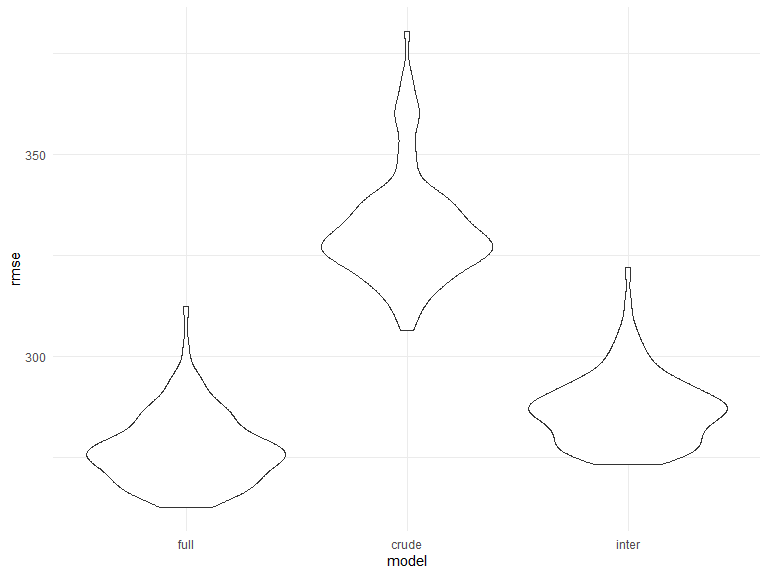

Homework 6
================
Shelley Shen
12/7/2020

## Problem 1

``` r
homicide_df = 
  read_csv("data/homicide-data.csv", na = c("", "NA", "Unknown")) %>% 
  mutate(
    city_state = str_c(city, state, sep = ", "),
    victim_age = as.numeric(victim_age),
    resolution = case_when(
      disposition == "Closed without arrest" ~ 0,
      disposition == "Open/No arrest"        ~ 0,
      disposition == "Closed by arrest"      ~ 1)
  ) %>% 
  filter(
    victim_race %in% c("White", "Black"),
    city_state != "Tulsa, AL") %>% 
  select(city_state, resolution, victim_age, victim_race, victim_sex)
```

    ## Parsed with column specification:
    ## cols(
    ##   uid = col_character(),
    ##   reported_date = col_double(),
    ##   victim_last = col_character(),
    ##   victim_first = col_character(),
    ##   victim_race = col_character(),
    ##   victim_age = col_double(),
    ##   victim_sex = col_character(),
    ##   city = col_character(),
    ##   state = col_character(),
    ##   lat = col_double(),
    ##   lon = col_double(),
    ##   disposition = col_character()
    ## )

Start with one city.

``` r
baltimore_df =
  homicide_df %>% 
  filter(city_state == "Baltimore, MD")

glm(resolution ~ victim_age + victim_race + victim_sex, 
    data = baltimore_df,
    family = binomial()) %>% 
  broom::tidy() %>% 
  mutate(
    OR = exp(estimate),
    CI_lower = exp(estimate - 1.96 * std.error),
    CI_upper = exp(estimate + 1.96 * std.error)
  ) %>% 
  select(term, OR, starts_with("CI")) %>% 
  knitr::kable(digits = 3)
```

| term              |    OR | CI\_lower | CI\_upper |
| :---------------- | ----: | --------: | --------: |
| (Intercept)       | 1.363 |     0.975 |     1.907 |
| victim\_age       | 0.993 |     0.987 |     1.000 |
| victim\_raceWhite | 2.320 |     1.648 |     3.268 |
| victim\_sexMale   | 0.426 |     0.325 |     0.558 |

Try this across cities.

``` r
models_results_df = 
  homicide_df %>% 
  nest(data = -city_state) %>% 
  mutate(
    models = 
      map(.x = data, ~glm(resolution ~ victim_age + victim_race + victim_sex, data = .x, family = binomial())),
    results = map(models, broom::tidy)
  ) %>% 
  select(city_state, results) %>% 
  unnest(results) %>% 
  mutate(
    OR = exp(estimate),
    CI_lower = exp(estimate - 1.96 * std.error),
    CI_upper = exp(estimate + 1.96 * std.error)
  ) %>% 
  select(city_state, term, OR, starts_with("CI")) 
```

``` r
models_results_df %>% 
  filter(term == "victim_sexMale") %>% 
  mutate(city_state = fct_reorder(city_state, OR)) %>% 
  ggplot(aes(x = city_state, y = OR)) + 
  geom_point() + 
  geom_errorbar(aes(ymin = CI_lower, ymax = CI_upper)) + 
  theme(axis.text.x = element_text(angle = 90, hjust = 1))
```


## Problem 2

#### Read in and clean the birthweight dataset.

``` r
baby_df = 
  read_csv("./data/birthweight.csv", na = c("", "NA", "Unknown")) %>% 
  mutate(
    babysex = as.factor(babysex),
    frace = as.factor(frace),
    frace = recode(frace, "1" = "White", "2" = "Black", "3" = "Asian", "4" = "Puerto Rican", "8" = "Other"),
    malform = as.factor(malform),
    mrace = as.factor(mrace),
    mrace = recode(mrace, "1" = "White", "2" = "Black", "3" = "Asian", "4" = "Puerto Rican", "8" = "Other"),
    smoken = as.factor(smoken),
    fincome = fincome * 100
  )
```

    ## Parsed with column specification:
    ## cols(
    ##   .default = col_double()
    ## )

    ## See spec(...) for full column specifications.

### Fit the models

I will examine three models to assess birthweight:

1.  Crude model examining length at birth and gestational age
2.  Interactions model examining head circumference, length, sex, and
    all interactions between these predictors (including three-way
    interaction)
3.  Full model examining head circumference, length, sex, mother’s race,
    mother’s pre-pregnancy BMI, family income, number of cigarettes
    smoked per day during pregnancy

**1. Crude model including main predictors**

  - `blength`: baby’s length at birth (cm)
  - `gaweeks`: gestational age in weeks

<!-- end list -->

``` r
crude_model = lm(bwt ~ blength + gaweeks, data = baby_df)

crude_model %>% 
  broom::glance()
```

    ## # A tibble: 1 x 12
    ##   r.squared adj.r.squared sigma statistic p.value    df  logLik    AIC    BIC
    ##       <dbl>         <dbl> <dbl>     <dbl>   <dbl> <dbl>   <dbl>  <dbl>  <dbl>
    ## 1     0.577         0.577  333.     2958.       0     2 -31381. 62771. 62796.
    ## # ... with 3 more variables: deviance <dbl>, df.residual <int>, nobs <int>

**2. Interaction model including variables**

  - `bhead`: head circumference
  - `blength`: baby’s length at birth (cm)
  - `babysex`: baby’s sex

<!-- end list -->

``` r
inter_model = lm(bwt ~ bhead + blength + babysex + bhead * blength + bhead * babysex + blength * babysex, data = baby_df)
```

**3. Full model including variables**

  - `bhead`: head circumference
  - `blength`: baby’s length at birth (cm)
  - `babysex`: baby’s sex
  - `mrace`: mother’s race
  - `ppbmi`: mother’s pre-pregnancy BMI
  - `fincome`: family monthly income
  - `smoken`: average number of cigarettes smoked per day during
    pregnancy

<!-- end list -->

``` r
full_model = lm(bwt ~ bhead + blength + babysex + mrace + ppbmi + fincome + smoken, data = baby_df)
```

### Plot the models

**1. Model of residuals vs. predicted values for crude model**

``` r
crude_plot = 
  baby_df %>% 
  modelr::add_residuals(crude_model) %>% 
  modelr::add_predictions(crude_model) %>% 
  ggplot(aes(x = pred, y = resid)) +
  geom_point(aes(alpha = 0.5)) +
  labs(
    title = "Residuals vs. predicted values for crude model",
    x = "Predicted values",
    y = "Residuals"
  )

crude_plot
```


**2. Model of residuals vs. predicted values for interactions model**

``` r
inter_plot = 
  baby_df %>% 
  modelr::add_residuals(inter_model) %>% 
  modelr::add_predictions(inter_model) %>% 
  ggplot(aes(x = resid, y = pred)) +
  geom_point(aes(alpha = 0.5)) + 
  labs(
    title = "Residuals vs. predicted values for interaction model",
    x = "Predicted values",
    y = "Residuals"
  )

inter_plot
```


**3. Model of residuals vs. predicated values for full model**

``` r
full_plot = 
  baby_df %>% 
  modelr::add_residuals(full_model) %>% 
  modelr::add_predictions(full_model) %>% 
  ggplot(aes(x = resid, y = pred)) +
  geom_point(aes(alpha = 0.5)) + 
  labs(
    title = "Residuals vs. predicted values for full model",
    x = "Predicted values",
    y = "Residuals"
  )

full_plot
```


### Cross-validation of models

I will compare the full model with the crude and interaction models by:

  - Creating test-training pairs
  - Unpacking the pairs
  - Assessing prediction accuracy
  - Plotting the RMSE’s

<!-- end list -->

``` r
cv_df = 
  crossv_mc(baby_df, 100) %>% 
  mutate(
    train = map(train, as_tibble),
    test = map(test, as_tibble)
  ) %>% 
  mutate(
    full_model = map(train, ~lm(bwt ~ bhead + blength + babysex + mrace + ppbmi + fincome + smoken, data = baby_df)),
    crude_model = map(train, ~lm(bwt ~ blength + gaweeks, data = baby_df)),
    inter_model = map(train, ~lm(bwt ~ bhead + blength + babysex + bhead * blength + bhead * babysex + blength * babysex, data = baby_df))
  ) %>% 
  mutate(
    rmse_full = map2_dbl(full_model, test, ~rmse(model = .x, data = .y)),
    rmse_crude = map2_dbl(crude_model, test, ~rmse(model = .x, data = .y)),
    rmse_inter = map2_dbl(inter_model, test, ~rmse(model = .x, data = .y))
  )
  
cv_plot = 
  cv_df %>% 
  select(starts_with("rmse")) %>% 
  pivot_longer(
    everything(),
    names_to = "model",
    values_to = "rmse", 
    names_prefix = "rmse_") %>% 
  mutate(model = fct_inorder(model)) %>% 
  ggplot(aes(x = model, y = rmse)) + 
  geom_violin()

cv_plot
```



When comparing the violin plots of the root mean squared errors, it
seems the full model which I hypothesized is the most predictive of the
variable `birthweight` out of the three models since it has the lowest
RMSE.

## Problem 3

Read in and clean dataset from 2017 Central Park weather data.

``` r
weather_df = 
  rnoaa::meteo_pull_monitors(
    c("USW00094728"),
    var = c("PRCP", "TMIN", "TMAX"), 
    date_min = "2017-01-01",
    date_max = "2017-12-31") %>%
  mutate(
    name = recode(id, USW00094728 = "CentralPark_NY"),
    tmin = tmin / 10,
    tmax = tmax / 10) %>%
  select(name, id, everything())
```

    ## Registered S3 method overwritten by 'hoardr':
    ##   method           from
    ##   print.cache_info httr

    ## using cached file: C:\Users\shens\AppData\Local\Cache/R/noaa_ghcnd/USW00094728.dly

    ## date created (size, mb): 2020-10-06 15:19:44 (7.537)

    ## file min/max dates: 1869-01-01 / 2020-10-31

Use bootstrapping to produce estimates for:

  - r^2
  - log(β0∗β1)

<!-- end list -->

``` r
weather_bootstrap = 
  weather_df %>% 
  modelr::bootstrap(n = 5000) %>%
  mutate(
    models = map(strap, ~lm(tmax ~ tmin, data = .x)),
    results_rsq = map(models, broom::glance),
    results_betas = map(models, broom::tidy)) 
```

#### R-squared

``` r
rsq_df = 
  weather_bootstrap %>% 
  select(-strap, -models) %>% 
  unnest(results_rsq) %>% 
  select(id = .id, rsq = r.squared)

rsq_plot =
  rsq_df %>%
  ggplot(aes(x = rsq)) + 
  geom_density() + 
  labs(
    title = "Distribution of r-squared",
    x = "r-squared value"
  )

rsq_plot
```


The distribution of r-squared is approximately normal, centered around
0.91 with a slight left skew.

#### Log(β0∗β1)

``` r
betas_df = 
  weather_bootstrap %>% 
  select(-strap, -models) %>% 
  unnest(results_betas) %>% 
  select(id = .id, term, estimate) %>% 
  pivot_wider(
    names_from = term,
    values_from = estimate
  ) %>% 
  select(id, b0 = `(Intercept)`, b1 = tmin) %>% 
  mutate(
    log_betas = log(b0 * b1)
  )

betas_plot = 
  betas_df %>% 
  ggplot(aes(x = log_betas)) +
  geom_density() +
  labs(
    title = "Distribution of log(β0∗β1)",
    x = "log(β0∗β1)"
  )

betas_plot
```


The distribution of log(β0∗β1) is also approximately normal, centered
around 2.02 with a very slight right skew.

## 95% Confidence Intervals for r^2 and log(β0∗β1)

``` r
full_df = 
  left_join(rsq_df, betas_df, by = "id") %>% 
  select(-b0, -b1)

full_df %>% 
  summarize(
    rsq_ci_lower = quantile(rsq, 0.025),
    rsq_ci_upper = quantile(rsq, 0.975),
    betas_ci_lower = quantile(log_betas, 0.025),
    betas_ci_upper = quantile(log_betas, 0.975)
  ) %>% 
  knitr::kable(
    col.names = c("R^2 CI lower bound", 
                  "R^2 CI upper bound",
                  "Log(β0∗β1) CI upper bound",
                  "Log(β0∗β1) CI lower bound"),
    digits = 3)
```

| R^2 CI lower bound | R^2 CI upper bound | Log(ß0\*ß1) CI upper bound | Log(ß0\*ß1) CI lower bound |
| -----------------: | -----------------: | -------------------------: | -------------------------: |
|              0.895 |              0.928 |                      1.965 |                      2.059 |
